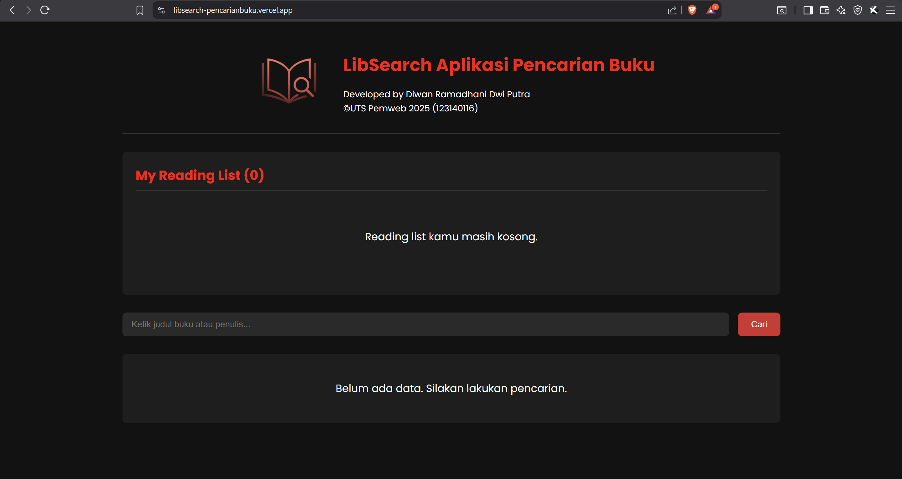
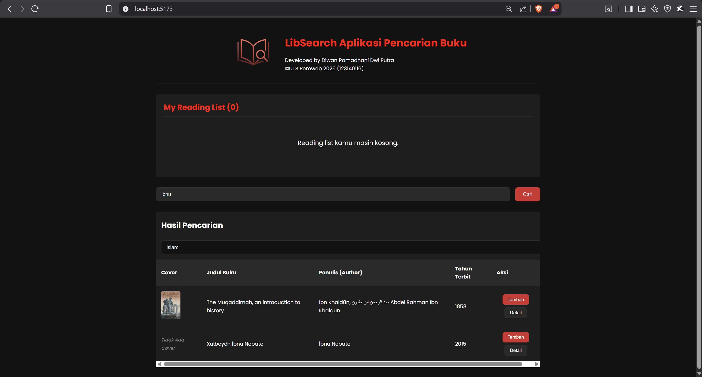

# UTS Front-End Web: LibSearch Aplikasi Pencarian Buku

* **Nama:** `Diwan Ramadhani Dwi Putra`
* **NIM:** `123140116`
* **Link Deployment Vercel:** **https://libsearch-pencarianbuku.vercel.app/**

---

## 📖 Deskripsi Project

Aplikasi ini adalah sebuah perpustakaan digital sederhana yang dibuat untuk project Ujian Tengah Semester (UTS) mata kuliah Pemrograman Web Institut Teknologi Sumatera. Aplikasi ini memungkinkan pengguna untuk mencari buku berdasarkan judul atau penulis menggunakan **Open Library API**.

Pengguna dapat melihat detail buku, menambahkan buku favorit ke "Reading List" pribadi (disimpan di `localStorage`).

## ✨ Fitur Utama

* **Pencarian Buku**: Mencari buku secara *real-time* dari Open Library API.
* **Tabel Hasil**: Menampilkan hasil pencarian dalam bentuk tabel yang mencakup cover, judul, penulis, dan tahun terbit.
* **Reading List**: Menambah dan menghapus buku dari daftar bacaan pribadi. Data ini tidak akan hilang meskipun browser ditutup (`localStorage`).
* **Filter Subject**: Memfilter hasil pencarian yang tampil di tabel berdasarkan *subject* atau kategori buku.
* **Detail Buku**: Menampilkan Pop-up dengan informasi mendetail tentang buku (deskripsi & subject) yang diambil dari endpoint API berbeda.
* **Desain Responsif**: Tampilan aplikasi sudah disesuaikan untuk perangkat mobile dan desktop.

---

## 🛠️ Technical Stack

* **Framework**: React.js (dibuat menggunakan Vite)
* **State Management**: React Hooks (`useState`, `useEffect`)
* **HTTP Client**: `fetch` API (bawaan browser)
* **Styling**: CSS, Flexbox, dan Grid.
* **Penyimpanan Lokal**: `localStorage`
* **Deployment**: Vercel

---

## 🚀 Cara Instalasi dan Menjalankan Project

Untuk menjalankan project ini di komputermu, ikuti langkah-langkah berikut:

1.  **Clone repository ini:**
    ```bash
    git clone [https://github.com/Ramaaaadevs/uts-pemweb-123140116.git](https://github.com/Ramaaaadevs/uts-pemweb-123140116.git)
    ```

2.  **Masuk ke direktori project:**
    ```bash
    cd uts-pemweb-123140116
    ```

3.  **Install semua dependency yang dibutuhkan:**
    ```bash
    npm install
    ```

4.  **Jalankan project di mode development:**
    ```bash
    npm run dev
    ```

5.  Buka browser dan akses `http://localhost:5173/` (atau alamat lain yang muncul di terminal).

---

## 📸 Screenshot Aplikasi

**1. Tampilan Utama**
> 

**2. Tampilan Hasil Pencarian & Filter**
> 

**3. Tampilan Pop-up Detail Buku**
> 